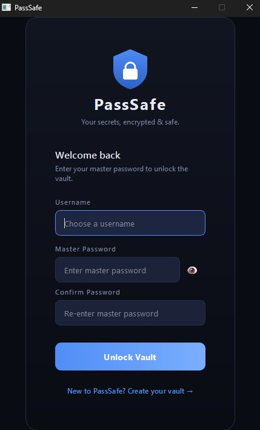
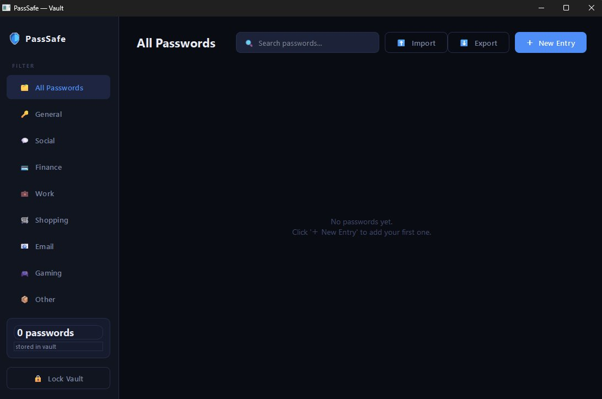
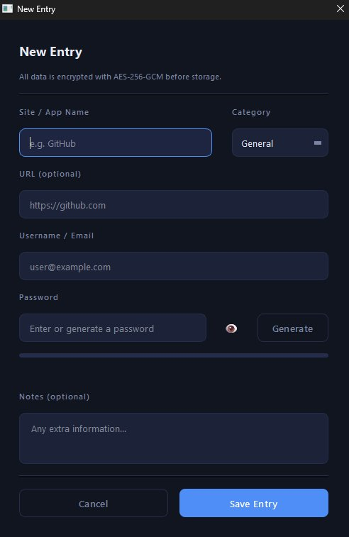
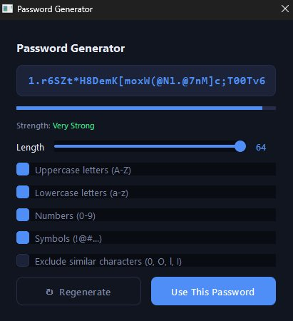

<div align="center">

<br/>

```
██████╗  █████╗ ███████╗███████╗███████╗ █████╗ ███████╗███████╗
██╔══██╗██╔══██╗██╔════╝██╔════╝██╔════╝██╔══██╗██╔════╝██╔════╝
██████╔╝███████║███████╗███████╗███████╗███████║█████╗  █████╗  
██╔═══╝ ██╔══██║╚════██║╚════██║╚════██║██╔══██║██╔══╝  ██╔══╝  
██║     ██║  ██║███████║███████║███████║██║  ██║██║     ███████╗
╚═╝     ╚═╝  ╚═╝╚══════╝╚══════╝╚══════╝╚═╝  ╚═╝╚═╝     ╚══════╝
```

### 🛡️ Your secrets, encrypted & safe — locally, always.

<br/>


<br/>

> **No cloud. No subscriptions. No tracking. Just your passwords — encrypted on your machine.**

<br/>

</div>

---

## 📖 Table of Contents

- [What is PassSafe?](#-what-is-passsafe)
- [Screenshots](#-screenshots)
- [Security Architecture](#-security-architecture)
- [Features](#-features)
- [Tech Stack](#-tech-stack)
- [Getting Started](#-getting-started)
- [How It Works](#-how-it-works)
- [File Structure](#-file-structure)
- [Contributing](#-contributing)
- [License](#-license)

---

## 🔐 What is PassSafe?

**PassSafe** is a fully local, open-source password manager built with Python and PyQt6. Every password you save is encrypted with **AES-256-GCM** before it ever touches your disk. Your master password never gets stored — only a cryptographic hash derived from 390,000 rounds of PBKDF2-SHA256.

No internet connection required. No account needed. No data ever leaves your machine.

---

## 📸 Screenshots

<div align="center">

<table>
  <tr>
    <td align="center"><b>🔐 Login Screen</b></td>
    <td align="center"><b>🗄️ Vault</b></td>
  </tr>
  <tr>
    <td></td>
    <td></td>
  </tr>
  <tr>
    <td align="center"><b>➕ New Entry</b></td>
    <td align="center"><b>🎲 Password Generator</b></td>
  </tr>
  <tr>
    <td></td>
    <td></td>
  </tr>
</table>

</div>

---

## 🔒 Security Architecture

PassSafe was built with a security-first mindset. Here's exactly how your data is protected:

```
Your Master Password
        │
        ▼
┌───────────────────────────────────────────┐
│  PBKDF2-SHA256  │  390,000 iterations     │
│  Random 32-byte salt per user             │
└───────────────────┬───────────────────────┘
                    │
          ┌─────────▼──────────┐
          │  256-bit AES Key   │
          └─────────┬──────────┘
                    │
        ┌───────────▼───────────┐
        │   AES-256-GCM         │
        │   Random 12-byte      │
        │   nonce per entry     │
        └───────────┬───────────┘
                    │
                    ▼
        🗄️  Encrypted blob stored
            in local SQLite DB
```

| Layer | Implementation | Why |
|---|---|---|
| **Master password** | PBKDF2-SHA256, 390k rounds | Brute-force resistant |
| **Salt** | 32 random bytes via `os.urandom()` | Prevents rainbow table attacks |
| **Vault encryption** | AES-256-GCM | Authenticated encryption — detects tampering |
| **Nonce** | 12 random bytes per entry | Guarantees unique ciphertext every time |
| **Clipboard** | Auto-clears after 15 seconds | Prevents clipboard snooping |
| **Comparison** | `secrets.compare_digest()` | Timing-attack safe |

> ⚠️ **Your master password cannot be recovered.** If forgotten, the vault cannot be decrypted. This is by design.

---

## ✨ Features

- 🔑 &nbsp; **AES-256-GCM encryption** on every stored password
- 🧂 &nbsp; **Unique salt + nonce** per user/entry — no two ciphertexts are alike
- 🗂️ &nbsp; **Categories** — General, Social, Finance, Work, Shopping, Email, Gaming, Other
- 🔍 &nbsp; **Live search** across site names, usernames, URLs and categories
- 🎲 &nbsp; **Password generator** with configurable length (8–64), character sets, and ambiguous character exclusion
- 💪 &nbsp; **Password strength meter** with real-time scoring
- 📋 &nbsp; **Copy to clipboard** with auto-clear after 15 seconds
- 📤 &nbsp; **CSV export** (plain-text — keep it safe!)
- 📥 &nbsp; **CSV import** — compatible with common password manager exports
- 🔒 &nbsp; **Lock vault** — return to login screen without closing the app
- 🌑 &nbsp; **Dark theme** throughout — easy on the eyes
- 📦 &nbsp; **100% local** — no internet, no cloud, no telemetry

---

## 🛠️ Tech Stack

| Technology | Role |
|---|---|
| **Python 3.10+** | Core language |
| **PyQt6** | Desktop GUI framework |
| **cryptography** | AES-256-GCM & PBKDF2 |
| **SQLite** | Local encrypted database |
| **secrets** | Cryptographically secure random generation |

---

## 🚀 Getting Started

### Prerequisites

- Windows 10 or 11
- Python 3.10+ — [Download here](https://www.python.org/downloads/)
  - ✅ Make sure to tick **"Add Python to PATH"** during installation

### Option A — Automatic Setup (recommended)

```bat
:: Just double-click setup.bat
:: It will install all dependencies and launch PassSafe automatically
```

### Option B — Manual Setup

```bash
# 1. Clone the repository
git clone git clone https://github.com/B0N5S/Encrypted-Local-Password-Manager.git
cd Encrypted-Local-Password-Manager

# 2. Install dependencies
pip install PyQt6 cryptography

# 3. Launch
python main.py
```

### After first launch

1. You'll be prompted to **create a vault** — choose a strong master password
2. That's it. Your vault is ready.
3. Next time, just run `run.bat` or `python main.py`

> 🔴 **Never forget your master password.** There is no reset or recovery — this is what makes it secure.

---

## ⚙️ How It Works

### Creating a vault
1. You choose a master password
2. A random 32-byte salt is generated
3. PBKDF2-SHA256 (390,000 rounds) derives a 256-bit key from your password + salt
4. The key hash and salt are stored in the local SQLite database
5. Your plain-text password is **never saved anywhere**

### Saving a password entry
1. You type (or generate) a password in the entry form
2. A random 12-byte nonce is generated
3. AES-256-GCM encrypts the password using your session key + nonce
4. The nonce + ciphertext blob is stored in the database

### Unlocking the vault
1. You enter your master password
2. It's re-derived through PBKDF2 with the stored salt
3. The result is compared to the stored hash using `secrets.compare_digest()`
4. If it matches, the session key is loaded into memory — **never written to disk**

---

## 📁 File Structure

```
Encrypted-Local-Password-Manager/
│
├── main.py              # Entry point — launches the app
├── auth_window.py       # Login & registration screen
├── vault_window.py      # Main vault UI (table, search, import/export)
├── entry_dialog.py      # Add/edit entry form + password generator
├── database.py          # SQLite interactions
├── crypto_utils.py      # Hashing, encryption, decryption, password gen
├── theme.py             # Dark theme colours & global stylesheet
│
├── setup.bat            # One-click setup & launcher (Windows)
├── run.bat              # Quick launcher after setup
│
└── passsafe.db          # 🔒 Auto-created on first run — NOT committed to git
```

> 📌 `passsafe.db` is your encrypted vault file. Add it to `.gitignore` — it should **never** be committed.

---

## 🤝 Contributing

Contributions are welcome! Here's how to get involved:

1. Fork the repository
2. Create a feature branch: `git checkout -b feature/my-feature`
3. Commit your changes: `git commit -m "Add my feature"`
4. Push: `git push origin feature/my-feature`
5. Open a Pull Request

### Ideas for contributions
- [ ] macOS / Linux support
- [ ] TOTP / 2FA code storage
- [ ] Breach detection via HaveIBeenPwned API (k-anonymity)
- [ ] Auto-lock after inactivity timeout
- [ ] Password history tracking
- [ ] Browser extension integration

---

## ⚖️ License

This project is licensed under the **MIT License** — see the [LICENSE](LICENSE) file for details.

---

<div align="center">

**Built with Python, PyQt6, and a genuine obsession with not getting hacked.**

⭐ If PassSafe helps you, consider leaving a star — it helps others find it.

<br/>


</div>
